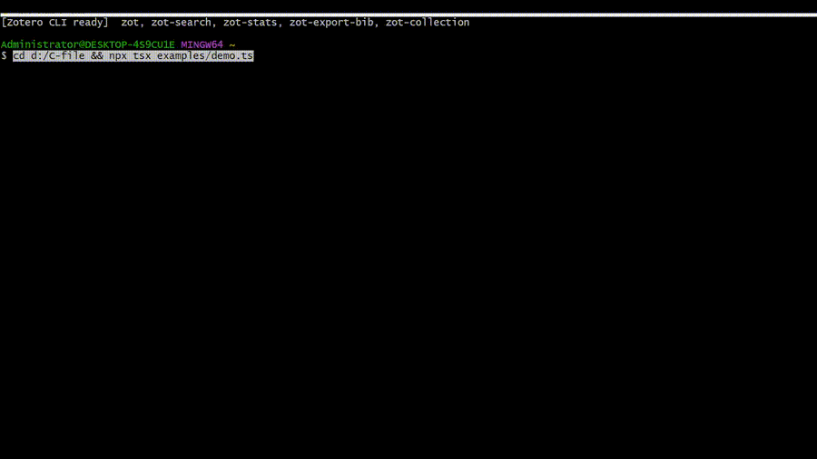

# Taor — TypeScript Agent Orchestration Runtime



> **30 行代码启动一个带权限+记忆的 Agent。**

```bash
git clone https://github.com/Tubo2333/taor.git
cd taor
pnpm install
pnpm demo
```

## 是什么 / What

Taor 是一个通用的 TypeScript Agent 运行时框架。12 个独立 npm 包，按需组合。

**核心特性：**

- **TAOR 循环引擎** — AsyncGenerator 状态机，Think → Act → Observe → Repeat，可暂停/可恢复/可超时中断
- **4 级权限引擎** — deny / boundary / allow / ask，`@resource` 注解定义文件系统边界约束
- **子 Agent 进程隔离** — child_process.fork + 心跳检测，每个子 Agent 独立运行
- **13 点生命周期钩子** — beforeThink / afterThink / beforeAct / afterAct / afterObserve / onError 等拦截点
- **3 层记忆系统** — SQLite（用户级）/ JSON（项目级）/ InMemory（会话级），可替换后端
- **5 层上下文压缩器** — trim → summarize → chunk → embed → truncate，廉价优先策略
- **OpenTelemetry 全链路追踪** — THINK → ACT → OBSERVE 每步可观测

## 包结构 / Packages

| 包 | 用途 |
|---|---|
| `@taor/core` | 核心类型、Harness、TAOR 循环 |
| `@taor/engine` | 聚合入口，createHarness() |
| `@taor/adapters` | LLM 适配器（Anthropic / OpenAI / DeepSeek） |
| `@taor/permission` | 4 级权限引擎 + @resource 边界约束 |
| `@taor/hooks` | 13 点生命周期钩子系统 |
| `@taor/tools` | 工具注册中心（Zod / JSON Schema 双路径） |
| `@taor/memory` | 3 层记忆系统 |
| `@taor/subagent` | 子 Agent 协调器 + 进程隔离 |
| `@taor/compressor` | 5 层上下文压缩 pipeline |
| `@taor/telemetry` | OpenTelemetry 分布式追踪 |
| `@taor/mcp` | MCP 外部工具集成 |
| `@taor/cli` | 命令行界面 |

## 快速开始 / Quick Start

```bash
# 安装依赖
pnpm install

# 构建所有包
pnpm build

# 运行 demo
pnpm demo
```

## 开发 / Development

```bash
# 类型检查
pnpm typecheck

# 运行测试
pnpm test
```

## License

MIT © 2026 Zuo Xin (Tubo2333)
